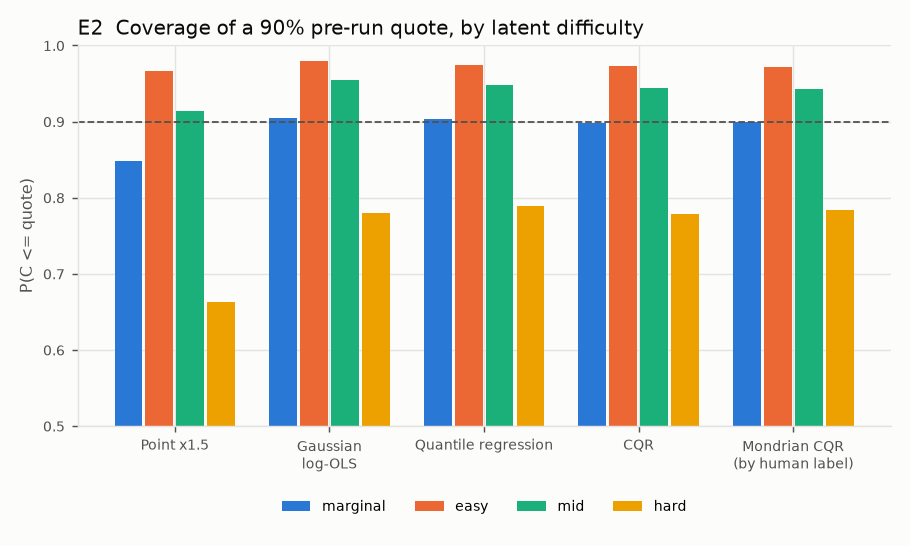
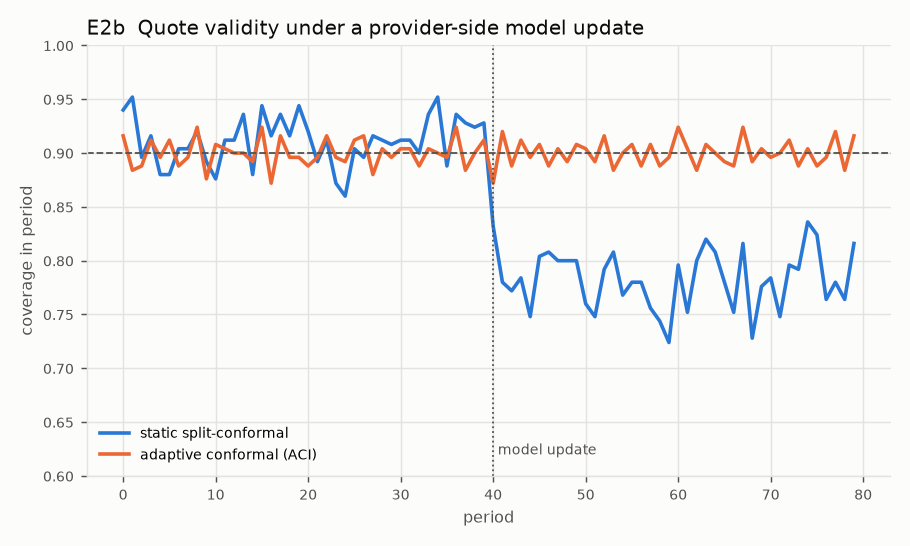
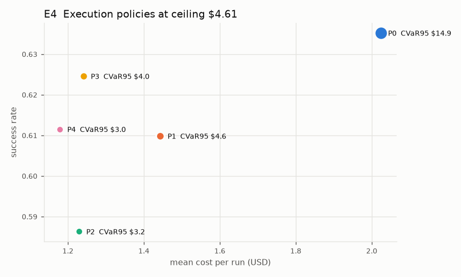
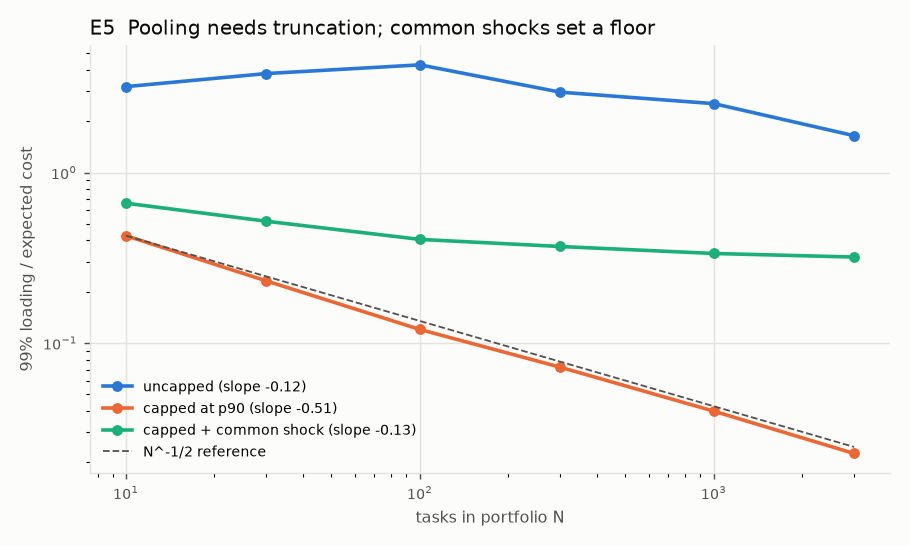

# Pesh — reproduction of the simulation study (E0–E5)

All numbers are **simulated** from the SMM-calibrated DGP (`pesh.sim`), not empirical estimates. Paper values are from Tiwari (2026), Section 5.

## E0 — Calibration vs published moments (Table 4)

| moment | target | simulated |
|---|---|---|
| mean_tokens_m | 4.03 | 4.646 |
| mean_cost | 2.07 | 2.176 |
| in_out_ratio | 148.0 | 158.953 |
| success | 0.651 | 0.632 |
| kendall_tau | 0.33 | 0.360 |
| maxmin_mean | 4.1 | 3.520 |
| icc | 0.8 | 0.831 |
| median / p90 / p99 cost | 1.18 / 4.22 / 15.55 (paper sim) | 0.87 / 4.96 / 23.40 |

## E1 — Predictability ceiling (Proposition 3)

| quantity | paper | here |
|---|---|---|
| rho_tau | 0.804 | 0.819 |
| feature_r2_log | 0.422 | 0.481 |
| feature_corr_level | 0.551 | 0.566 |
| oracle_r2_log | 0.776 | 0.788 |
| corr ceiling sqrt(rho) | 0.897 | 0.905 |

## E2 — Pre-run quotes, target 90% (Table 5)

| method | marginal | easy | mid | hard | label_0 | label_1 | label_2 | loop_runs | clean_runs | quote_over_mean_cost | median_quote_over_median_cost |
|---|---|---|---|---|---|---|---|---|---|---|---|
| Point x1.5 | 0.848 | 0.966 | 0.914 | 0.663 | 0.864 | 0.852 | 0.828 | 0.599 | 0.903 | 1.501 | 2.571 |
| Gaussian log-OLS | 0.904 | 0.979 | 0.954 | 0.780 | 0.916 | 0.909 | 0.889 | 0.710 | 0.948 | 1.989 | 3.406 |
| Quantile regression | 0.904 | 0.975 | 0.948 | 0.789 | 0.902 | 0.915 | 0.894 | 0.713 | 0.946 | 2.060 | 3.427 |
| CQR | 0.898 | 0.973 | 0.944 | 0.779 | 0.896 | 0.910 | 0.889 | 0.701 | 0.942 | 1.997 | 3.322 |
| Mondrian CQR (by human label) | 0.899 | 0.972 | 0.942 | 0.783 | 0.900 | 0.893 | 0.904 | 0.702 | 0.943 | 2.053 | 3.265 |

Finite-sample behaviour of split conformal (Figure 4):

| n | theory | mean | p05 | p95 |
|---|---|---|---|---|
| 30 | 0.903 | 0.905 | 0.802 | 0.970 |
| 100 | 0.901 | 0.897 | 0.850 | 0.938 |
| 300 | 0.900 | 0.900 | 0.873 | 0.925 |
| 1000 | 0.900 | 0.898 | 0.884 | 0.911 |

## E2b — Provider-side model update (Figure 5)

| | paper | here |
|---|---|---|
| static, pre-shift | 0.899 | 0.912 |
| static, post-shift | 0.704 | 0.783 |
| ACI, post-shift | 0.900 | 0.900 |
| ACI, first 5 post-shift periods | — | 0.898 |

## E3 — Caps censor the training data (Table 6), tau=0.75, 20% censored, Powell converged in 13 iterations

| estimator | slope_repo | slope_complex | bias_repo | bias_complex | coverage_hard_tercile |
|---|---|---|---|---|---|
| ground truth | 0.649 | 0.518 | 0.000 | 0.000 | 0.509 |
| uncensored, same n | 0.654 | 0.495 | 0.007 | -0.045 | 0.496 |
| naive QR on capped logs | 0.416 | 0.325 | -0.360 | -0.372 | 0.292 |
| Powell censored QR | 0.643 | 0.492 | -0.010 | -0.050 | 0.490 |
| Chernozhukov-Hong 3-step | 0.541 | 0.417 | -0.167 | -0.196 | 0.381 |

## E4 — Execution controllers at B = $4.61 (Table 7)

|  | mean_cost | cvar95 | p_exceed_B | success | cost_per_success | mean_cost_change | cvar95_change | success_change_pp |
|---|---|---|---|---|---|---|---|---|
| P0 no control | 2.024 | 14.934 | 0.100 | 0.635 | 3.186 | 0.000 | 0.000 | 0.000 |
| P1 hard cap | 1.443 | 4.589 | 0.000 | 0.610 | 2.367 | -0.287 | -0.693 | -2.537 |
| P2 cap + feasibility stop | 1.229 | 3.165 | 0.000 | 0.586 | 2.096 | -0.393 | -0.788 | -4.890 |
| P3 cap + degrade | 1.241 | 4.041 | 0.000 | 0.625 | 1.987 | -0.387 | -0.729 | -1.063 |
| P4 cap + feasibility + degrade | 1.179 | 2.975 | 0.000 | 0.612 | 1.928 | -0.417 | -0.801 | -2.370 |

Paper, P4: mean cost −41%, CVaR95 −76%, success −4.1pp.

## E5 — Tails, pooling and the value of a ceiling

| tail index (Hill) | steps | cost | cost/steps |
|---|---|---|---|
| mechanism (Pareto steps, alpha_T=2.2) | 2.19–2.20 | 1.24–1.25 | 0.56–0.57 |
| calibrated DGP, no window | 3.56–4.36 | 1.91–2.31 | |
| calibrated DGP, 300k window | 3.56–4.36 | 2.50–3.21 | |

Pooling log-log slopes: uncapped -0.12 (paper −0.02), capped -0.51 (paper −0.52), capped + shock -0.13 (paper −0.12); floor at N=3000: 0.32 (paper ≈0.23).

Monthly spend, 2,000 tasks/month with a common shock:

| | mean | sd | CV | CVaR95 | success |
|---|---|---|---|---|---|
| uncapped | 4391 | 680 | 0.155 | 5972 | 0.636 |
| capped | 3004 | 295 | 0.098 | 3656 | 0.612 |

Willingness to pay for the ceiling, Eq. (12), as a share of uncapped monthly spend:

| buyer | WTP share | expected saving | risk saving | quality cost |
|---|---|---|---|---|
| eta=1, v=$0 | 52.8% | 1387 | 930 | 0 |
| eta=1, v=$20 | 30.5% | 1387 | 930 | 975 |
| eta=0, v=$20 | 9.4% | 1387 | 0 | 975 |
| eta=0, v=$50 | -23.9% | 1387 | 0 | 2438 |
